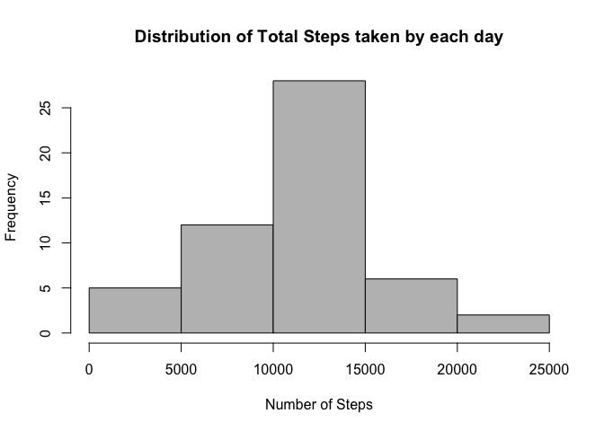
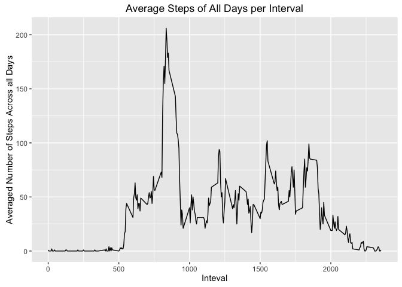
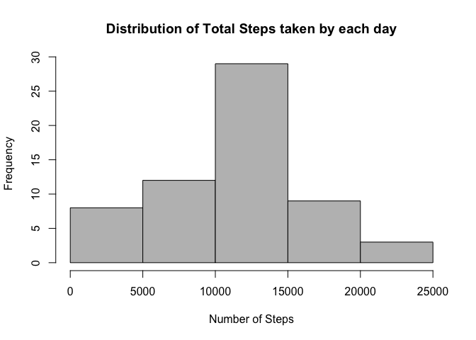
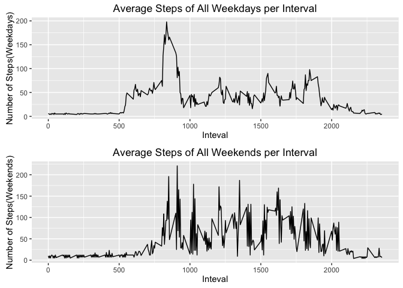

## Introduction
This assignment makes use of data from a personal activity monitering device.This device collects data at 5 minute intervals through out the day. The data consists of two months of data from an anonymous individual collected during the months of October and November, 2012 and include the number of steps taken in 5 minute intervals each day.

## Dataset:
[Activity monitoring data](https://d396qusza40orc.cloudfront.net/repdata%2Fdata%2Factivity.zip)[52k]

* **steps:** Number of steps taking in a 5-minute interval(missing values are coded as <span style = "color:red;">NA</span>)
* **date:** The date on which the measurement was taken in YYYY-MM-DD format
* **interval:** Identifier for the 5-minute interval in which measurement was taken

The dataset is stored in a CSV file and there are a total of 17,568 observations in this dataset.

## Assignment
### Loading and preprocessing the data
* Clear all lists from memory, setup working directory, and import all necessary packages 

```r
rm(list = ls())
# setwd("./Documents/R_Programming/")

library(plyr)
library(ggplot2)
```

```
## Warning: package 'ggplot2' was built under R version 3.2.4
```

```r
library(gridExtra)
```

```
## Warning: package 'gridExtra' was built under R version 3.2.5
```

```r
library(knitr)
```
* Check directory if the the zip file exists, if not, download the zip file, unzip it and read the data.`activity` stores dataset with NAs, and `activity_data` is not. 

```r
filename <- "repdata%2Fdata$2Factivity.zip"

if(!file.exists(filename)){
  url <- "https://d396qusza40orc.cloudfront.net/repdata%2Fdata%2Factivity.zip"
  download.file(url, method = "curl", destfile = "repdata_data_activity.zip")
}

if (!file.exists("activity.csv")){
  unzip("repdata_data_activity.zip")
}

activity = read.csv("activity.csv")
activity_data = activity[!is.na(activity$steps), ]
```

### What is mean total number of steps taken per day?
* Calculate the total number of steps taken per day

```r
TotalByDay = aggregate(steps ~ date, activity_data, sum)
```
* Create a histogram to show the distribution of total number of steps taken each day

```r
hist(TotalByDay$steps, col = "grey", xlab = "Number of Steps",
     main = "Distribution of Total Steps taken by each day")
```

<!-- -->

* Create a histogram to show the distribution of total steps taken by each date
[histogram: used to show distribution of variables, plotting quantitative data with ranges of the data grouped into bins/intervals;
barplot: used to compare variables, plotting categorical variables]

```r
Steps_mean <- round(mean(TotalByDay$steps, na.rm = T), 0)
Steps_median <- median(TotalByDay$steps, na.rm = T)
```

```
## The mean of the total number of steps taken per day is: 10766
```

```
## The median of the total number of steps taken per day is: 10765
```

### What is the average daily activity pattern?
* Calculate the average steps by intervals of all days using `plyr` package

```r
IntervalByDays <- ddply(activity_data, .(interval), summarize, Avg = as.integer(mean(steps)))
```
* Make a time serious plot of the 5-minute interval(x-axis) and the average number of steps taken, averaged across all days(y-axis) using `ggplot2` package

```r
ggplot(IntervalByDays, aes(x = interval, y = Avg)) +
geom_line() + xlab("Inteval") + ylab("Averaged Number of Steps Across all Days") +
ggtitle("Average Steps of All Days per Interval")
```

<!-- -->

* Find the maximum number of steps and its interval from dataframe `IntervalByDays`

```r
Max_Interval_Steps <- IntervalByDays[IntervalByDays$Avg == max(IntervalByDays$Avg),]
Max_Interval <- Max_Interval_Steps$interval
Max_Steps <- Max_Interval_Steps$Avg
```

```
## No. 835 interval contains the maximum number of steps, which is 206 .
```

### Imputing missing values
* Calculate and report the total number of missing values in the dataset(the total number of rows with <span style = "color:red;">NA</span>)

```r
NA_rows <- sum(is.na(activity$steps))
```

```
## 2304 rows have missing values in the activity dataset.
```
* Fill in all the missing values by using the mean for that 5-minute interval and create a new dataset with the missing data filled in

```r
activity_Int <- merge(activity, IntervalByDays, by = "interval")
get_NASteps <- which(is.na(activity$steps))
New_activity <- activity
New_activity[get_NASteps,"steps"] <- activity_Int[get_NASteps,"Avg"]
```
* Make a histogram of the total number of steps taken each day and calculate and report the _mean_ and _median_ total number of steps taken per day.

```r
New_TotalByDay <- aggregate(steps ~ date, New_activity, sum)
hist(New_TotalByDay$steps, col = "grey", xlab = "Number of Steps",
     main = "Distribution of Total Steps taken by each day")
```

<!-- -->

```r
New_Steps_mean <- round(mean(New_TotalByDay$steps, na.rm = T),0)
New_Steps_median <- median(New_TotalByDay$steps, na.rm = T)
```

```
## The mean of the total number of steps taken per day is: 10872
```

```
## The median of the total number of steps taken per day is: 11015
```

Compared to the original, these values differ from the estimates from the first part of the assignment. After filling NAs with the average of steps in each interval, the mean and median increased by 0.9% and 2% respectively, whilte the maximum steps increased by 13%.

### Are there differences in activity patterns between weekdays and weekends?
* Split new dataset into `activity_wdays` and `activity_wends` dataset

```r
activity_wdays <- New_activity[weekdays(as.Date(New_activity$date)) != c("Saturday", "Sunday"), ]
activity_wends <- New_activity[weekdays(as.Date(New_activity$date)) == c("Saturday", "Sunday"), ]
```
* Make a panel plot containing time serious plots of the 5-minute interval and the average number of steps taken, averaged across all weekdays days and weekends days

```r
IntervalByDays_wdays <- ddply(activity_wdays, .(interval), summarize, Avg = as.integer(mean(steps)))
IntervalByDays_wends <- ddply(activity_wends, .(interval), summarize, Avg = as.integer(mean(steps)))

plot1 <- ggplot(IntervalByDays_wdays, aes(x = interval, y = Avg)) +
  geom_line() + xlab("Inteval") + ylab("Number of Steps(Weekdays)") +
  ggtitle("Average Steps of All Weekdays per Interval")
plot2 <- ggplot(IntervalByDays_wends, aes(x = interval, y = Avg)) +
  geom_line() + xlab("Inteval") + ylab("Number of Steps(Weekends)") +
  ggtitle("Average Steps of All Weekends per Interval")
wdays_wends <- grid.arrange(plot1, plot2, nrow = 2, ncol = 1)
```

<!-- -->


